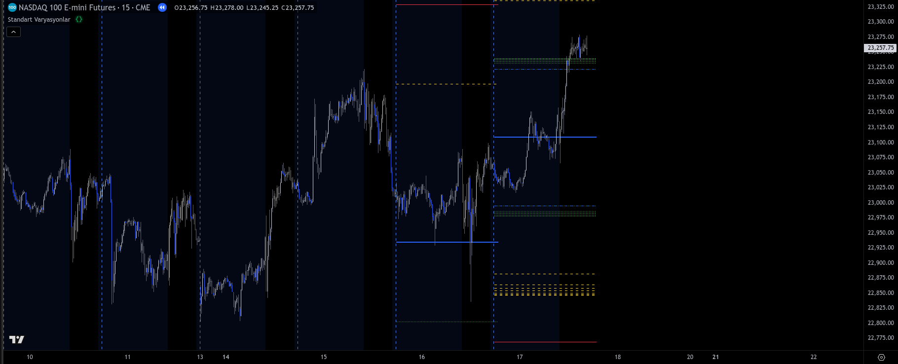

# Standard Variation Indicator for Price Range Analysis:  Data Automation in Financial Markets

## Introduction
This project showcases a technical solution developed to streamline a manual daily volatility analysis workflow. Originally conducted using pen and paper on a trading floor, the process was first automated in Excel and later evolved into a fully visualized script built on TradingView using Pine Script (TradingView’s internal scripting language).

The script dynamically calculates historical price ranges and visualizes them to support data-driven trading decisions. It demonstrates the ability to identify repetitive manual tasks and replace them with automated, scalable solutions tailored for high-speed financial environments.

## Table of Contents
- [Business Context & Problem](#2-business-context--problem)
- [Solution Overview](#3-solution-overview)
- [Technical Skills Demonstrated](#4-technical-skills-demonstrated)
- [Business & Analytical Skills Demonstrated](#5-business--analytical-skills-demonstrated)
- [Sample Output](#6-sample-output)

## Business Context & Problem
During my role as a Fixed Income Sales Trader, **I manually calculated the prior day's price ranges and statistical deviations to identify high-probability support and resistance levels. This was a time-consuming, repetitive, and error-prone process — often under time pressure during market open.**

Business needs addressed:
1. Reduce manual workload and human error.
2. Improve consistency and accuracy in technical analysis.
3. Enable data-backed trading decisions grounded in historical price behavior.

**This indicator resolves these pain points by automating the creation and visualization of volatility-based zones, supporting faster and more reliable trading decisions.**

## Solution Overview
The script runs at the start of each trading day and performs the following tasks:
1. Calculates the previous day’s high, low, and midpoint
2. Computes average daily range over multiple lookback periods: 2, 4, 8, 16, 32, 64, 128 days
3. Dynamically draws horizontal lines based on range multipliers:
- Half-range (0.5x) → green dotted lines
- Full-range (1.0x) → yellow dashed lines
- One-and-a-half range (1.5x) → red solid lines

All levels are calculated from the midpoint and automatically adjust based on historical data.

This setup allows traders to:
1. Instantly visualize historical volatility zones.
2. See how current price interacts with key statistical thresholds.
3. Incorporate quantitative levels into decision-making frameworks.

## Technical Skills Demonstrated
1. **Pine Script (TradingView)** - built a fully custom indicator with efficient use of arrays, line plotting, and performance-aware architecture.
2. **Time Series Analysis** - applied statistical aggregation techniques across different temporal windows.
3. **Data Automation** - eliminated manual recalculations through time-based triggers and persistent variables (var).
4. **Clean Code Practices** - designed for readability and daily reusability without code edits.
5. **Statistical Thinking** - modeled volatility zones aligned with real-world trading logic.

## Business & Analytical Skills Demonstrated
1. **Problem Solving in Real-Time Settings** - converted a manual, risk-sensitive workflow into a repeatable, automated model.
2. **Financial Markets Expertise** - incorporated volatility logic grounded in professional fixed income and technical trading strategies.
3. **Insight Generation** - designed to reveal actionable relationships between price and statistical range behavior.
4. **Efficiency-First Mindset** - replaced a daily task with a zero-maintenance script.
5. **Scalable Thinking** - the solution is generic enough to be applied to other asset classes or integrated into multi-script toolkits.

## Sample Output
